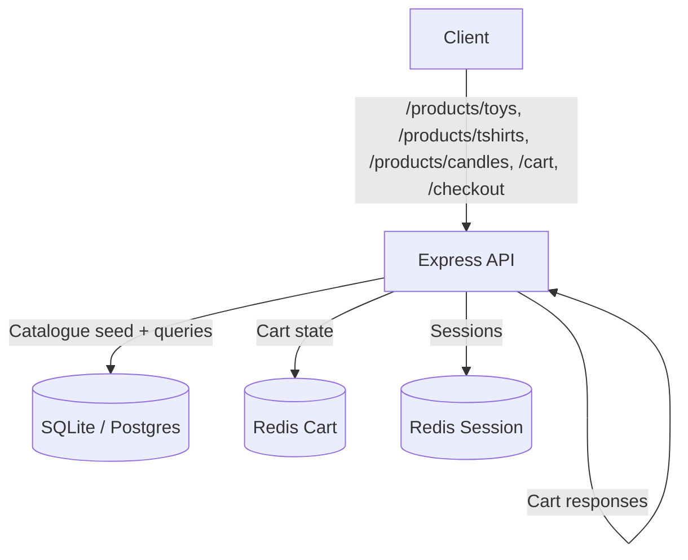

# Wiztopia Backend

This folder contains the Express-based API that powers the Wiztopia Cyber Security Toy Store demo. It exposes unauthenticated endpoints for product categories (toys, t-shirts, candles), cart management, and a mocked checkout experience.

The bundled catalogue in `src/data/toys.json`, `src/data/tshirts.json`, and `src/data/candles.json` are sample data meant to unblock prototyping; replace them with the real product feed before launch. Likewise, image paths currently reference local dev assets (`/images/assets/...`) .

When you run via Docker Compose the service connects to the bundled PostgreSQL container (`postgres:5432`).

Running the backend directly with no DB env vars falls back to SQLite stored under `./data`.

## Runtime Flow


- `/products/toys`, `/products/tshirts`, `/products/candles` serve catalogue data from SQL (PostgreSQL in Docker, SQLite when running standalone).
- `/cart` and `/checkout` persist state in Redis. If the cart service is unavailable, the endpoints return `503 Service Unavailable` to surface the outage.
- `/healthz` reports liveness for probes and monitoring.

## API Documentation
- OpenAPI 3.0 specification: `docs/openapi.yaml`

Use the OpenAPI file to generate clients, build Swagger UI, or drive contract tests for downstream consumers.

## API Endpoints (cURL Examples)

Here are example cURL commands to interact with the backend API:

### Health Check
```bash
curl http://localhost:4000/healthz
```

### Product Categories
*   **Get all toy products:**
    ```bash
    curl 'http://localhost:4000/products/toys'
    ```
*   **Get all t-shirt products:**
    ```bash
    curl 'http://localhost:4000/products/tshirts'
    ```
*   **Get all candle products:**
    ```bash
    curl 'http://localhost:4000/products/candles'
    ```

### Cart Functionality
*   **Get the current user's cart:**
    ```bash
    curl -b cookies.txt http://localhost:4000/cart
    ```
    (Use `-b cookies.txt` to send the session cookie, which links to your cart.)

*   **Add an item to the cart:**
    ```bash
    curl -c cookies.txt -b cookies.txt -X POST -H "Content-Type: application/json" -d '{"productId": "vulnerflipper-spatula", "quantity": 1}' http://localhost:4000/cart/items
    ```
    (Replace `vulnerflipper-spatula` with a valid product ID from your product lists.)

*   **Update an item's quantity in the cart:**
    ```bash
    curl -c cookies.txt -b cookies.txt -X PUT -H "Content-Type: application/json" -d '{"quantity": 2}' http://localhost:4000/cart/items/vulnerflipper-spatula
    ```

*   **Remove an item from the cart:**
    ```bash
    curl -c cookies.txt -b cookies.txt -X DELETE http://localhost:4000/cart/items/vulnerflipper-spatula
    ```

*   **Clear the entire cart:**
    ```bash
    curl -c cookies.txt -b cookies.txt -X DELETE http://localhost:4000/cart
    ```

### Checkout
*   **Process checkout:**
    ```bash
    curl -c cookies.txt -b cookies.txt -X POST http://localhost:4000/checkout
    ```

## How to run locally

```bash
docker-compose down -v && docker-compose build backend && docker-compose up
```

##

Ensured CC number match https://www.freeformatter.com/credit-card-number-generator-validator.html
